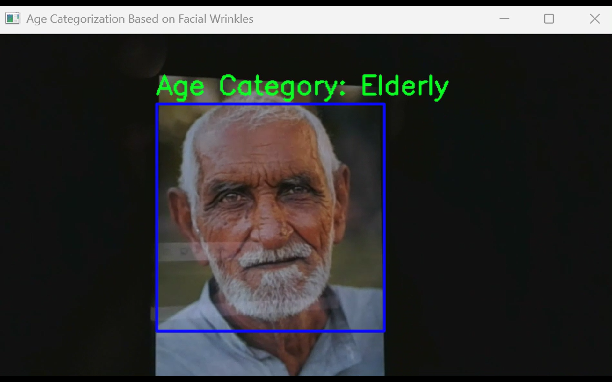

# Wrinklage

Wrinklage is an **age categorization system** using **facial wrinkle detection** with OpenCV. It captures live video from the webcam, detects faces, applies edge detection (Canny algorithm) to facial regions prone to wrinkles, and classifies the detected person into **Young**, **Middle-aged**, or **Elderly** based on wrinkle density.

---

## Features

- **Face Detection** with OpenCV's Haar Cascade classifier to detect frontal faces (`haarcascade_frontalface_default.xml`).
- **Age categorization** estimates wrinkle density and classifies age as:
  - `Young` (low wrinkle percentage)
  - `Middle-aged` (moderate wrinkle percentage)
  - `Elderly` (high wrinkle percentage)
- **Real-time Processing**: Streams video from the webcam and overlays classification results live.

---

## Quick Start

1. Clone the repository:

```bash
git clone https://github.com/reyhanarief/wrinklage.git
cd wrinklage
```

2. Install dependencies:

```bash
# Python 3.9+ recommended
pip install opencv-python
```

3. Run the script:

```bash
python wrinklage.py
```

- Press `ESC` to quit the application.
- A window will open showing live video with detected faces, and predicted age category.

---

## How It Works

1. Captures frames from the webcam.
2. Detects faces using Haar Cascade classifier.
3. Resizes the detected face for consistent processing.
4. Defines **regions of interest** (forehead, eyes, cheeks).
5. Runs Canny edge detection on each region with tuned thresholds.
6. Calculates wrinkle density and averages results.
7. Classifies into **Young** / **Middle-aged** / **Elderly**.
8. Displays bounding boxes, and categorization text.

---

## Screenshots

### Age Categorization Result




---

## Disclaimer

- This is a **proof of concept**. Wrinkle density is a crude proxy and can be affected by lighting, image quality, makeup, facial hair, ethnicity, and lifestyle factors. Do **not** use for medical, hiring, or any sensitive decision-making.
- Consider privacy and consent when capturing faces.

---

## License

[](LICENSE)

---

## Acknowledgments

Built with [OpenCV](https://opencv.org/). Core logic and parameters are implemented directly in `wrinklage.py`.
